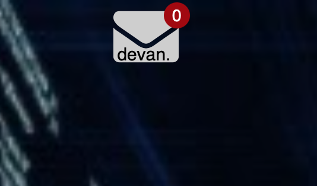

# ubersicht-unread-gmail
Show number of unread gmail using the gmail api and written in rust.



## Installation
Download and unzip the zip file.
Move it into the widgets directory for uebersicht to read.
Go to the link [https://console.cloud.google.com/home/dashboard?project=gmail-project-308315](https://console.cloud.google.com/home/dashboard?project=gmail-project-308315) and create a new project. Create one Auth 2.0 Client ID and download the json file. Put it in the widget directory under the name: credentials.json

Your done!

## Multiple accounts
If you have multiple accounts you can make a copy of the widget and edit the first line of the index.coffee file.
The first line should take this format:
```
command: "relative_from_widgets_folder_path/to/mail_unread_counter -t='relative_from_widgets_folder_path/tokencache.json' -c='relative_from_widgets_folder_path/to/credentials.json' ..."
```
